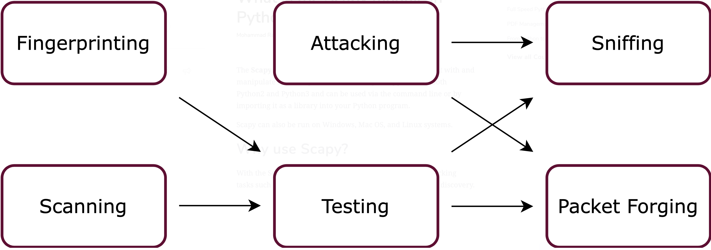

# Net Scanner Tool ( English )

- Network scanning refers to the use of a computer network to gather information regarding computing systems. Network scanning is mainly used for security assessment, system maintenance, and also for performing attacks by hackers.

- With the tool we have written, we can view the ip & mac addresses in the network. In short, scanning in the network
--- 
### What is the optparse library and what does it do ? 

- optparse is a more convenient, flexible, and powerful library for parsing command-line options than the old getopt module. optparse uses a more declarative style of command-line parsing: you create an instance of OptionParser, populate it with options, and parse the command line. optparse allows users to specify options in the conventional GNU/POSIX syntax, and additionally generates usage and help messages for you. 

- Optparse module makes easy to write command-line tools. 

1. optparse make it easy to handle the command-line argument.
2. It comes default with python.
3. It allows dynamic data input to change the output


--- 
### Creating an OptionParser object √

##### `Example:`

```console

import optparse
parser = optparse.OptionParser()

```

### Defining options √

* It should be added one at a time using the add_option(). Each Option instance represents a set of synonymous command-line option string.


##### `Way to create an Option instance are:`

```console
OptionParser.add_option(option)

```
## [*Documentation*](https://docs.python.org/3/library/optparse.html#background)

--- 

### What is the scapy library and what does it do ? 

- The Scapy module is a Python-based library used to interact with and manipulate network packets. The library is supported by both Python2 and Python3 and can be used via the command line or by importing it as a library into your Python program.

- Scapy can also be run on Windows, Mac OS, and Linux systems.

- In addition, Scapy offers two major advantages:

- While other network modules (such as Wireshark or Nmap) were built for specific purposes like packet sniffing and network scanning, Scapy’s functionalities can be used to build new, high-level functions as per the author’s requirement.
Other networking tools output filtered results by interpreting the received packets. Scapy outputs full decoded packets, leaving the interpretation up to the user.
---
  

---
##### `İnstall scapy`

* To install the Scapy module in Python3, run the following command:

```console
pip3 install scapy-python3

```

* You can also download the latest developmental version from Github using:


```console
$ git clone https://github.com/secdev/scapy.git

```

## [*Documentation*](https://scapy.readthedocs.io/en/latest/introduction.html)

---

# Ağ Taraycı Aracı ( Turkish ) 

- Ağ taraması, bilgi işlem sistemleriyle ilgili bilgi toplamak için bir bilgisayar ağının kullanılması anlamına gelir. Ağ taraması temel olarak güvenlik değerlendirmesi, sistem bakımı ve ayrıca bilgisayar korsanlarının saldırılarını gerçekleştirmek için kullanılır.

- Python ile yazmış olduğumuz araç ile ağdaki ip & mac adreslerini görebiliriz. Kısacası, ağda tarama sağlayabiliyoruz. Bunun üzerine response ( Tepki ) oluşturabiliriz.  

---
### Optparse modülü nedir ve ne işe yarar?

- optparse, komut satırı seçeneklerini ayrıştırmak için eski getopt modülünden daha kullanışlı, esnek ve güçlü bir modüldür. optparse daha bildirimsel bir komut satırı ayrıştırma stili kullanır: bir OptionParser örneği yaratır, onu seçeneklerle doldurur ve komut satırını ayrıştırırsınız. optparse, kullanıcıların geleneksel GNU/POSIX sözdiziminde seçenekleri belirlemesine olanak tanır.

- Optparse modülü komut satırı araçları yazmayı kolaylaştırır.

1. optparse, komut satırı argümanını kullanmayı kolaylaştırır.
2. Python ile varsayılan olarak gelir.
3. Dinamik veri girişinin çıkışı değiştirmesine izin verir

`Bir başka deyişle;`

        optparse -> terminal içinde kullanıcıdan input almaya yarıyor. 
        ( Bunun yanı sıra --help / -h yardım veya kullanım mesajlarıda oluşturulabilmektedir. 

---

### OptionParser nesnesi oluşturma √

##### `Örnek:`

```console

optparse'ı içe aktar
ayrıştırıcı = optparse.OptionParser()

```

### Seçenekleri tanımlama √

- add_option() kullanılarak birer birer eklenmelidir. Her Option örneği, komut satırında bir seçenek dizesini temsil eder.


##### `Option örneği oluşturmanın yolu:`

```console
OptionParser.add_option(seçenek)

```
## [*Dökümantasyon ( İngilizce )*](https://docs.python.org/3/library/optparse.html#background)

---

### Scapy modülü nedir ve ne işe yarar?

- Scapy modülü, ağ paketleriyle etkileşim kurmak ve bunları işlemek için kullanılan Python tabanlı bir modüldür. Scapy modülü hem Python2 hem de Python3 tarafından desteklenmektedir. Ayrıca komut satırı aracılığıyla veya modül olarak Python programınıza import ederek ( dahil ederek ) kullanılabilir.

- Scapy hem Windows hem Mac OS hemde Linux sistemlerinde de çalıştırılabilir.

- Ek olarak, Scapy iki önemli avantaj sunar:

- Diğer ağ modülleri (Wireshark veya Nmap gibi) paket algılama ve ağ taraması gibi belirli amaçlar için oluşturulmuş olsa da, Scapy'nin işlevleri, geliştiricinin ihtiyacına göre yeni, yüksek seviyeli işlevler oluşturmak için kullanılabilir.
Diğer ağ araçları, alınan paketleri yorumlayarak filtrelenmiş sonuçlar verir. 
---
   

---

##### `Install scapy`

* Python3'te Scapy modülünü kurmak için aşağıdaki komutu terminalde çalıştırın:

``console
pip3 install scapy-python3

```

* Son sürümünü Github'dan indirmek için aşağıdaki kodu terminale yazarak indirebilirsiniz:


``console
$ git clone https://github.com/secdev/scapy.git

```

## [*Dökümantasyon ( İngilizce )*](https://scapy.readthedocs.io/en/latest/introduction.html)

---
